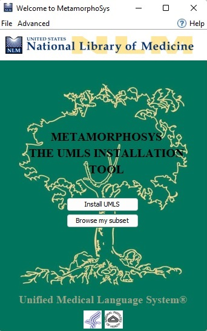
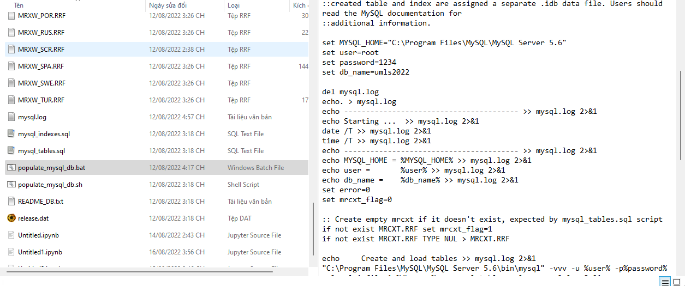
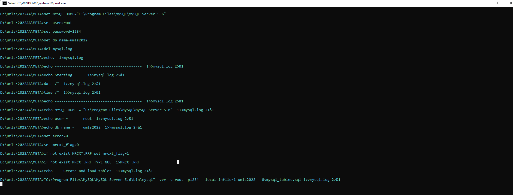
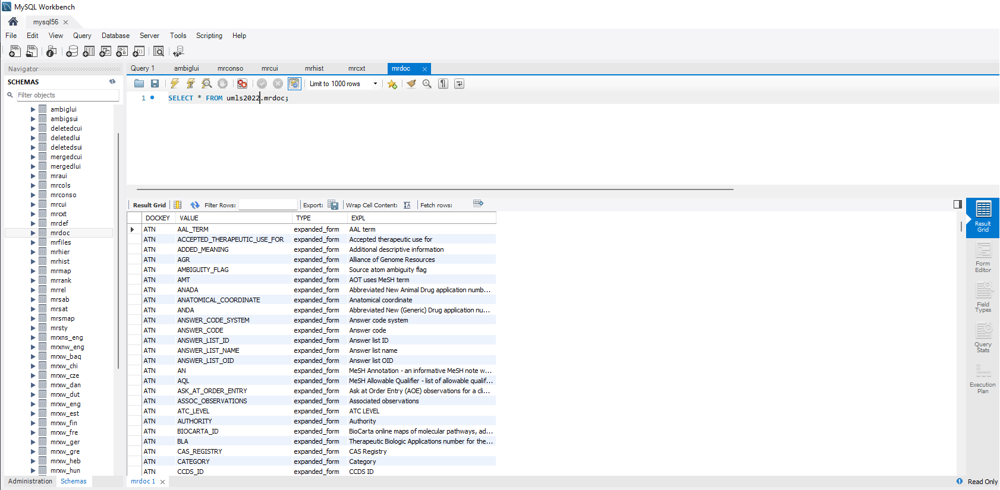

# Install and load UMLS knowledge base into MySQL
## Step 1: Install UMLS knowledge source
- Download UMLS's 2022AA release files in the following [link](https://www.nlm.nih.gov/research/umls/licensedcontent/umlsknowledgesources.html).
- Unzip the UMLS release files and then unzip `mmsys.zip` into the current folder. 
- Click `run64.bat` (Windows) or `run_linux.sh` or `run_mac.sh` according to your enviroment to run MetamorphoSys application and customize your UMLS subset.

You can see details [here](https://www.nlm.nih.gov/research/umls/implementation_resources/metamorphosys/help.html)

## Step 2: Install Mysql and Load db to MySQL
- Download and install mysql server 5.6 from [here](https://downloads.mysql.com/archives/installer/)
- For convenience of browsing data, we also install [MySQL WorkBench](https://dev.mysql.com/downloads/workbench/) to have GUI for operating MySQL database's data. 
- Before running this script file, we need to create a schema or database inside the MySQL database server. Turn to the `META` folder that contains mysql script file `populate_mysql_db.bat` and change MySQL login information (db user,db password, db name) inside the `bat` file. 

- Then, we run the `populate_mysql_db.bat` and wait for its completion.  

- Finally, we got entire datasets of UMLS stored in MySQL 5.6 server so later we can easily fetch necessary contents from MySql server.

